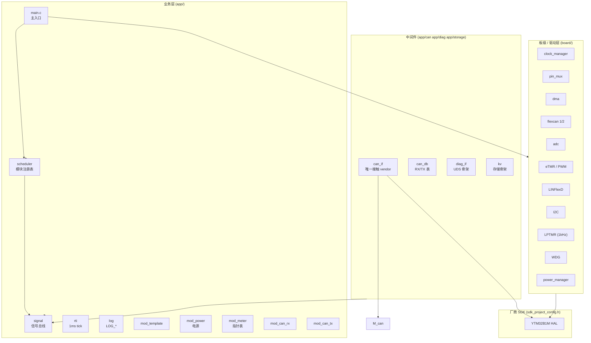
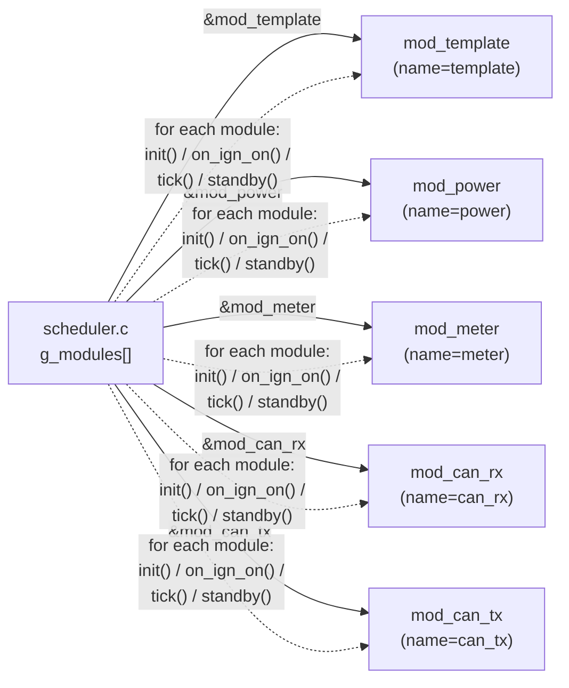
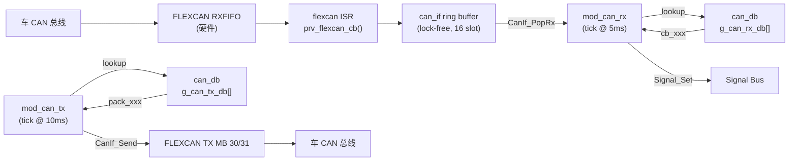
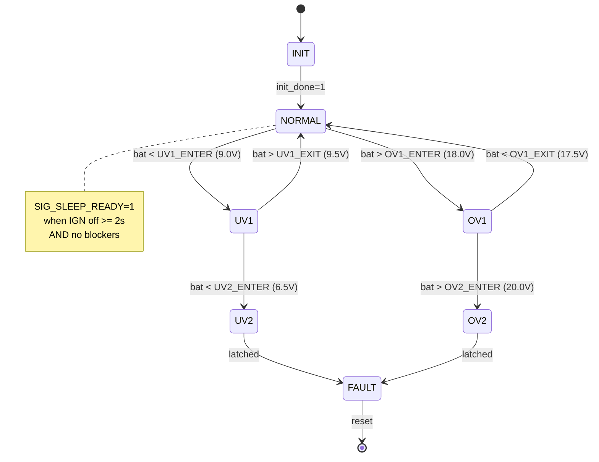

# 架构图 (Architecture Diagrams)

> 本文档以 Mermaid 形式给出 C02-B2 仪表 MCU 软件的整体架构与关键数据流。
> 在 GitHub / GitLab / VSCode 中可直接渲染；CI 中可用 `mmdc` 导出 PNG/SVG。

---

## 1. 分层视图 (Layered View)



**层级约束（CI 卡点）：**
- 业务层 (`app/<feature>/*.c`) 不得直接 `#include` 任何 `flexcan_driver.h / adc_driver.h / ...`
- 唯一例外：`app/can/can_if.c`（必须接触 vendor 才能调度 RX/TX）
- 业务层不得有 `extern` 跨文件全局变量（`scheduler.c` 例外：声明 `extern const mod_desc_t mod_xxx`）

---

## 2. 主循环时序 (Main Loop Timing)

```mermaid
sequenceDiagram
    autonumber
    participant ISR as LPTMR ISR (1 kHz)
    participant RTI as rti
    participant MAIN as main()
    participant SCH as scheduler
    participant MOD as mod_xxx
    participant BUS as Signal Bus

    loop every 1 ms (interrupt)
        ISR->>RTI: RTI_OnTick1ms()
        RTI->>RTI: s_tick_ms++
    end

    Note over MAIN: for(;;) Scheduler_Run(); __WFI();
    loop every iteration
        MAIN->>SCH: Scheduler_Run()
        loop for each module in g_modules[]
            SCH->>MOD: m->tick()
            MOD->>RTI: RTI_IsElapsed(period)
            RTI-->>MOD: true / false
            alt period elapsed
                MOD->>BUS: Signal_Set(...)
                MOD->>BSP: Board_*(...)
            end
        end
        MAIN->>MAIN: __WFI() ; sleep until next ISR
    end
```

**关键点：**
- `__WFI` 让 CPU 在中断前休眠，1 ms 后被 LPTMR 唤醒
- 每个模块的 `tick()` 内部用 `RTI_IsElapsed()` 自决子周期，**禁止**用全局 flag 变量

---

## 3. 模块注册表 (Module Registry)



**新增模块的步骤：**
1. 创建 `app/<feature>/<feature>.c`，实现四个 `prv_*` 钩子
2. 在 `app/<feature>/<feature>.h` 声明 `extern const mod_desc_t mod_<feature>;`
3. 在 `scheduler.c` 的 `g_modules[]` 数组中 `+1` 行 `&mod_<feature>`

**无需修改：** main / 调度逻辑 / 其他模块

---

## 4. CAN 数据流 (CAN Data Flow)



**关键点：**
- 唯一接触 vendor `flexcan_driver.h` 的文件：`app/can/can_if.c`
- RX 路径：ISR → ring (single-producer single-consumer lock-free) → tick 消费 → signal 发布
- TX 路径：tick 内 `pack()` 填 payload → `CanIf_Send()` → vendor MB
- 应用代码不直接 `FLEXCAN_DRV_*`，便于单元测试 + 移植

---

## 5. 电源状态机 (Power State Machine)



阈值定义见 `board/board_power.h`：

| 常量 | 值 | 说明 |
|------|-----|------|
| `PWR_UV2_ENTER_MV` | 6500  | 进入 UV2（锁死） |
| `PWR_UV2_EXIT_MV`  | 7000  | 退出 UV2 |
| `PWR_UV1_ENTER_MV` | 9000  | 进入 UV1（警告） |
| `PWR_UV1_EXIT_MV`  | 9500  | 退出 UV1 |
| `PWR_OV1_ENTER_MV` | 18000 | 进入 OV1（警告） |
| `PWR_OV1_EXIT_MV`  | 17500 | 退出 OV1 |
| `PWR_OV2_ENTER_MV` | 20000 | 进入 OV2（锁死） |

---

## 6. 信号总线所有权 (Signal Bus Ownership)

```mermaid
graph TB
    subgraph OWNER["信号所有者 (writer)"]
        S_PWR[mod_power]
        S_CR[mod_can_rx]
        S_TX[mod_can_tx]
        S_BSP[board_power ISR]
    end

    subgraph SIG["Signal Bus (signal.c)"]
        SIG_IGN["SIG_IGN_ON"]
        SIG_BAT["SIG_KL30_VOLTAGE_MV"]
        SIG_MODE["SIG_PWR_MODE"]
        SIG_RDY["SIG_SLEEP_READY"]
        SIG_SPD["SIG_VEH_SPEED_KPH_X10"]
        SIG_RPM["SIG_ENG_RPM"]
        SIG_FUEL["SIG_FUEL_LEVEL_PCT"]
        SIG_TT["SIG_TT_* (20+ telltales)"]
    end

    subgraph READER["信号消费者 (reader)"]
        R_MAIN[main]
        R_MTR[mod_meter]
        R_DIAG[mod_diag_if]
        R_TX[mod_can_tx]
    end

    S_PWR --&gt; SIG_IGN
    S_PWR --&gt; SIG_BAT
    S_PWR --&gt; SIG_MODE
    S_PWR --&gt; SIG_RDY
    S_CR --&gt; SIG_SPD
    S_CR --&gt; SIG_RPM
    S_CR --&gt; SIG_FUEL
    S_CR --&gt; SIG_TT

    SIG_IGN --&gt; R_MAIN
    SIG_BAT --&gt; R_TX
    SIG_MODE --&gt; R_TX
    SIG_RDY --&gt; R_MAIN
    SIG_SPD --&gt; R_MTR
    SIG_RPM --&gt; R_MTR
    SIG_FUEL --&gt; R_MTR
    SIG_TT --&gt; R_DIAG
```

**约束：**
- 每个 Signal **唯一所有者**（写入者），消费者通过 `Signal_Get()` 只读
- 跨模块通信**禁止**用 `extern` 全局变量
- 完整列表见 `app/signal/signal.h`

---

## 7. 启动顺序 (Boot Sequence)

```mermaid
sequenceDiagram
    autonumber
    participant VEC as vector.S
    participant MAIN as main()
    participant BSP as bsp_init.c
    participant DRV as drv_init.c
    participant RTI as rti
    participant CIF as can_if
    participant SCH as scheduler
    participant PWR as mod_power
    participant MTR as mod_meter
    participant CRX as mod_can_rx
    participant CTX as mod_can_tx

    VEC->>MAIN: __main() ; reset
    MAIN->>BSP: BSP_Init()
    BSP->>BSP: CLOCK / PINS / DMA / WDG / POWER
    MAIN->>DRV: DRV_Init()
    DRV->>DRV: UART/ADC/eTMR/I2C/FLEXCAN/FLASH
    MAIN->>RTI: RTI_Init()
    MAIN->>CIF: CanIf_Init()
    CIF->>CIF: FLEXCAN_DRV_Init + InstallEventCallback
    MAIN->>SCH: Scheduler_Init()
    SCH->>PWR: mod_power.init(1)
    SCH->>MTR: mod_meter.init(1)
    SCH->>CRX: mod_can_rx.init(1)
    SCH->>CTX: mod_can_tx.init(1)
    MAIN->>PWR: Power_IsIgnOn() ?
    alt IGN already on
        MAIN->>SCH: Scheduler_OnIgnOn()
        SCH->>PWR: mod_power.on_ign_on()
        SCH->>MTR: mod_meter.on_ign_on()
        SCH->>CRX: mod_can_rx.on_ign_on()
        SCH->>CTX: mod_can_tx.on_ign_on()
    end
    Note over MAIN: for(;;) { Scheduler_Run(); __WFI(); }
```

---

## 8. 工具链与 CI (Toolchain & CI)

```mermaid
flowchart LR
    subgraph DEV["开发者本地"]
        ED["IAR 9.x<br/>EWARM"]
        GIT["git + .clang-format"]
    end

    subgraph CI["CI (GitHub Actions)"]
        LINT["clang-format --dry-run<br/>(可选)"]
        CHECK["bash tools/check.sh<br/>(硬卡点)"]
        DOXY["bash tools/check_doxygen.sh<br/>(硬卡点)"]
        BUILD["IAR build<br/>(命令行)"]
    end

    subgraph ART["产物"]
        HEX["HEX / ELF"]
        DOC["Doxygen HTML"]
    end

    ED --&gt; GIT
    GIT --&gt; LINT
    GIT --&gt; CHECK
    GIT --&gt; DOXY
    GIT --&gt; BUILD
    CHECK --&gt; ART
    DOXY --&gt; ART
    BUILD --&gt; ART
```

**本地预检：** `bash tools/check.sh && bash tools/check_doxygen.sh`

---

## 9. 文件 → 章节索引

| 文件 / 目录 | 章节 | 说明 |
|-------------|------|------|
| `app/main.c` | §7 | 启动顺序 |
| `app/scheduler/` | §3 | 模块注册表 |
| `app/rti/` | §2 | 1ms tick + 子周期 |
| `app/signal/` | §6 | 信号总线 |
| `app/can/can_if.c` | §4 | CAN RX/TX 唯一接触点 |
| `app/can/can_rx.c` | §4 | RX 派发 + 超时 |
| `app/can/can_tx.c` | §4 | TX 周期 / 事件 |
| `app/power/` | §5 | 电源状态机 |
| `app/meter/` | §6 | 指针表（消费 speed/rpm/fuel/temp） |
| `app/mod_template/` | §3 | 新模块的复制起点 |
| `app/diag/diag_if.c` | §6 | UDS 接入点 |
| `app/storage/kv.c` | §6 | KV 存储（被 diag 间接使用） |
| `board/board_power.c` | §5 | KL30 / IGN 硬件 |
