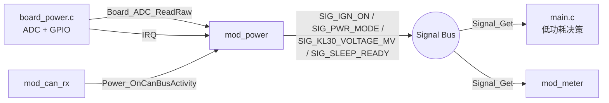
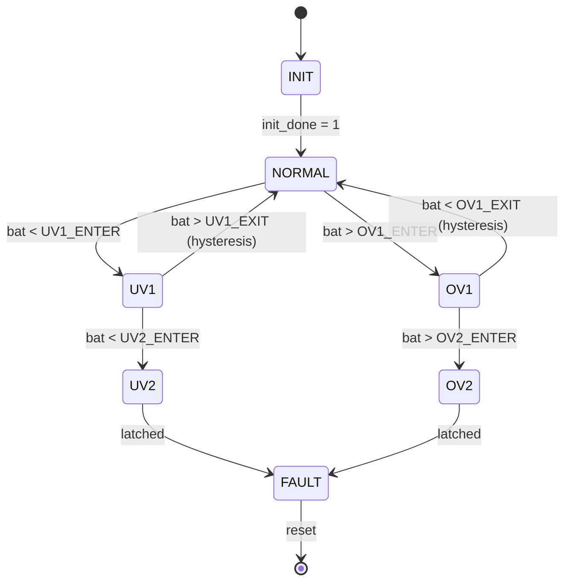

# 软件详细设计文档：mod_power

> Software Detailed Design Document — Power Management Module
>
> **本文件是 `docs/SDD_TEMPLATE.md` 的一个完整填充示例。**
> 业务开发请按此模板编写各模块的 SDD。

---

## 0. 文档信息

| 项目     | 内容 |
|----------|------|
| 模块名   | `mod_power` |
| 文件路径 | `app/power/` |
| 版本     | v0.1.0 |
| 作者     | Architecture Team |
| 创建日期 | 2026-07-05 |
| 评审人   | <待定> |
| 关联 PR  | <待定> |

---

## 1. 概述 (Overview)

### 1.1 目的

mod_power 是 C02-B2 仪表 MCU 的**电源管理**模块，负责任一以下职责：

- 采样 KL30（常电）与 IGN（KL15 点火）电压并发布到信号总线；
- 实现 KL30 的欠压/过压状态机（UV1/UV2/OV1/OV2/FAULT）；
- 监测 IGN 边沿并通过 `Scheduler_OnIgnOn()` 广播给所有模块；
- 聚合"可休眠"信号 `SIG_SLEEP_READY`，供低功耗决策使用；
- 对外提供 IRQ 接入点（`Board_RegisterIgnIrq`）和 CAN 活动通知 API
  （`Power_OnCanBusActivity`），用于延长唤醒窗口。

### 1.2 范围 (Scope)

- **包含：** ADC 采样、电压分级、IGN 边沿、sleep 聚合
- **不包含：** MCU 实际进入 STOP/WAIT 模式（由 main 轮询 `SIG_SLEEP_READY` 决策）、
  CAN 收发器 STBY 引脚控制（由 `CanIf_GoToSleep` 实现）

### 1.3 术语表

| 术语   | 含义 |
|--------|------|
| KL30   | 常电，电瓶直接供电 |
| KL15 / IGN | 点火信号，钥匙打到 ON |
| UVx    | Under-Voltage 等级（x=1 警告，x=2 锁死） |
| OVx    | Over-Voltage 等级 |
| FAULT  | 锁死状态，模块不再可恢复 |

---

## 2. 参考文档 (References)

- 项目架构：`docs/ARCHITECTURE.md`
- 注释规范：`docs/DOXYGEN_STYLE.md`
- 信号总线：`docs/SIGNAL_GUIDE.md`
- 关联模块：`docs/SDD_CAN.md`（IGN / 电源信号来源）
- 整车规范：客户需求 §3.2 电源管理

---

## 3. 设计约束 (Design Constraints)

- ADC 通道：KL30 → `BOARD_ADC_CH_KL30`（默认 0），IGN → `BOARD_ADC_CH_IGN`（默认 1）
- 12-bit ADC，5 V 参考，分压比 1:5 → 满量程约 25 V
- IGN debounce：3 次连续采样 = 30 ms
- KL30 分级阈值（见 `board/board_power.h`）：
  - UV2_ENTER = 6.5 V（锁死）
  - UV1_ENTER = 9.0 V（警告）
  - OV1_ENTER = 18.0 V（警告）
  - OV2_ENTER = 20.0 V（锁死）
- 模块私有状态全部 `static`，无 `extern` 跨文件变量
- 跨模块通信走 `Signal_*` 总线
- `Board_*` 抽象层隔离寄存器，模块不直接碰 GPIO/ADC 驱动

---

## 4. 模块结构 (Module Structure)

### 4.1 文件清单

| 文件 | 职责 |
|------|------|
| `app/power/power.h` | 公开 API + `pwr_mode_t` 枚举 + `mod_power` 描述符声明 |
| `app/power/power.c` | 私有状态 + 4 个钩子 + 公开 API + 模块描述符 |
| `board/board_power.h` | 硬件层接口（ADC 通道、阈值、寄存器包装） |
| `board/board_power.c` | 硬件层实现（ADC 读取、IRQ 注册） |

### 4.2 内部组成

```
power.c
├── 私有状态 (s_ctx)        ← IGN debounce, bat_mv, mode, off-counter, blockers
├── prv_classify_voltage()  ← 电压 → pwr_mode_t
├── prv_publish_state()     ← 推送所有 Signal
├── mod_desc_t hooks        ← init / on_ign_on / tick / standby
├── 公开 API                ← Power_OnIgnEdgeIrq, Power_OnCanBusActivity,
│                              Power_RequestSleep, Power_ClearSleepRequest,
│                              Power_GetMode, Power_IsIgnOn, Power_IsSleepReady
└── mod_power               ← const mod_desc_t
```

### 4.3 与其他模块的关系



---

## 5. 接口设计 (Interface Design)

### 5.1 公开 API

| 函数 | 用途 | 调用方 |
|------|------|--------|
| `Power_OnIgnEdgeIrq()` | 通知 IGN 边沿（ISR 上下文） | `Board_RegisterIgnIrq` 回调 |
| `Power_OnCanBusActivity()` | 通知 CAN 活动以延长唤醒 | `mod_can_rx` 回调 |
| `Power_RequestSleep()` | 标记本模块为 sleep 阻止者 | 长事务模块 |
| `Power_ClearSleepRequest()` | 释放 sleep 阻止 | 同上 |
| `Power_GetMode()` | 取当前电源模式 | main / diag |
| `Power_IsIgnOn()` | 取 IGN 状态 | main / scheduler |
| `Power_IsSleepReady()` | 取 sleep 准备就绪状态 | main |

> 详细签名 / 参数 / 返回值见 `app/power/power.h` 的 Doxygen 块。

### 5.2 mod_desc_t 钩子

| 钩子 | 周期 | 职责 |
|------|------|------|
| `init(1)` | 启动一次 | 零状态、注册 IGN IRQ、读初始 ADC |
| `on_ign_on()` | IGN 上升沿 | 重置 `ign_off_ticks_100ms` |
| `tick()` | 主循环 | 10 ms：ADC 采样 + debounce；100 ms：分级 + 发布 |
| `standby()` | 进入低功耗 | 日志记录状态 |

### 5.3 消费的 Signal

| Signal | 用途 |
|--------|------|
| （无输入 Signal；本模块为信号源） |

### 5.4 发布的 Signal

| Signal | 值域 | 周期 | 说明 |
|--------|------|------|------|
| `SIG_IGN_ON` | 0/1 | 事件 | IGN debounce 后状态 |
| `SIG_KL30_VOLTAGE_MV` | 0..25000 | 100 ms | KL30 电压 (mV) |
| `SIG_PWR_MODE` | pwr_mode_t | 100 ms | 当前电源模式 |
| `SIG_IGN_OFF_COUNTER` | 0..0xFFFF | 100 ms | IGN off 100ms tick 数 |
| `SIG_SLEEP_READY` | 0/1 | 100 ms | 聚合后的 sleep 许可 |

---

## 6. 数据结构 (Data Structure)

### 6.1 私有上下文

```c
typedef struct {
    u8  init_done;             /* 0 / 1                                 */
    u8  ign_raw;               /* 最近一次 ADC 采样 (0/1)                */
    u8  ign_debounce;          /* 连续相同采样计数                       */
    bool ign_on;
    bool ign_on_prev;
    u16 bat_mv;                /* KL30 当前电压                          */
    pwr_mode_t mode;
    pwr_mode_t mode_prev;
    u16 ign_off_ticks_100ms;   /* IGN off 100ms tick 计数                */
    u8  sleep_blockers;        /* 阻止 sleep 的模块数                    */
} pwr_ctx_t;

static pwr_ctx_t s_ctx;
```

| 字段 | 初始值 | 并发要求 |
|------|--------|----------|
| `init_done` | 0 | 仅主循环写 |
| `ign_raw` | 0 | 仅主循环写 |
| `ign_debounce` | 0 | ISR / 主循环都写（`Power_OnIgnEdgeIrq` 重置） |
| `bat_mv` | 0 | 仅主循环写 |
| `sleep_blockers` | 0 | 多模块原子加/减（u8 读改写，无并发风险） |

### 6.2 私有常量

```c
#define PWR_IGN_DEBOUNCE_TICK  3u      /* 3 × 10ms = 30ms */
```

---

## 7. 状态机 (State Machine)



### 7.1 状态转换表

| 源状态 | 事件 | 目标状态 | 动作 |
|--------|------|----------|------|
| INIT   | init_done = 1 | NORMAL | `prv_publish_state()` |
| NORMAL | bat < UV1_ENTER (9000 mV) | UV1 | LOG_W, update SIG_PWR_MODE |
| UV1    | bat < UV2_ENTER (6500 mV) | UV2 | LOG_W |
| NORMAL | bat > OV1_ENTER (18000 mV) | OV1 | LOG_W |
| OV1    | bat > OV2_ENTER (20000 mV) | OV2 | LOG_W |
| UV2/OV2 | latched | FAULT | 清 sleep_ready，触发 shutdown |

> 滞回（hysteresis）由 `board/board_power.h` 中 `_ENTER_MV` / `_EXIT_MV` 体现；
> 当前实现用 `prv_classify_voltage` 简化分级，不在状态机内做滞回（待 v0.2）。

---

## 8. 算法描述 (Algorithm Description)

### 8.1 IGN debounce（30 ms）

```c
if (raw_ign != s_ctx.ign_raw) {
    s_ctx.ign_raw = raw_ign;
    s_ctx.ign_debounce = 0;
} else if (++s_ctx.ign_debounce >= PWR_IGN_DEBOUNCE_TICK) {
    bool new_ign = (raw_ign != 0);
    if (new_ign != s_ctx.ign_on) {
        s_ctx.ign_on = new_ign;
        Signal_Set(SIG_IGN_ON, new_ign ? 1 : 0);
    }
}
```

ISR (`Power_OnIgnEdgeIrq`) 仅把 `ign_debounce` 清零，让 tick 立即重采样。

### 8.2 KL30 分级（O(1) 查表）

```c
if (mv == 0)              return FAULT;
if (mv < UV2_ENTER)       return UV2;
if (mv < UV1_ENTER)       return UV1;
if (mv > OV2_ENTER)       return OV2;
if (mv > OV1_ENTER)       return OV1;
return NORMAL;
```

### 8.3 Sleep 聚合

```c
bool ready = (!ign_on)
          && (ign_off_ticks_100ms >= 20)   /* IGN off 至少 2 s */
          && (sleep_blockers == 0)
          && (mode == NORMAL);
Signal_Set(SIG_SLEEP_READY, ready ? 1 : 0);
```

---

## 9. 错误处理 (Error Handling)

| 错误源 | 检测 | 处理 |
|--------|------|------|
| ADC 返回 0 | `bat_mv == 0` | mode = FAULT，发布 SIG_PWR_MODE |
| IGN 边沿抖动 | debounce 计数 | 30 ms 内多次变化 → 忽略 |
| `Board_ADC_ReadRaw` 阻塞 | （无） | 调用方需保证非阻塞（轮询） |
| sleep_blockers 溢出 | `u8` 上限 255 | 钳位到 255 |

### 9.1 故障安全 (Fail-safe)

- 默认状态：未初始化时所有 Signal invalid，Get 返回 0
- 关键判定（sleep）由多个独立条件 AND，避免单点误判
- Watchdog 由 `mod_power` 不直接负责，由 main 统一喂狗

---

## 10. 性能与资源 (Performance & Resource)

| 指标 | 预算 | 实测 | 备注 |
|------|------|------|------|
| ROM | < 1 KB | TBD | IAR 编译后 `*.map` |
| RAM | < 64 B | TBD | 静态分配 |
| 10 ms tick 耗时 | < 50 µs | TBD | 含 2 次 ADC 读取 + 分级 |
| 100 ms tick 耗时 | < 10 µs | TBD | 仅 publish 4 个 Signal |
| ISR 耗时 | < 5 µs | TBD | 仅清 debounce 计数器 |

> 实测在 IAR 9.x + `-O balance` 条件下记录。

---

## 11. 测试要点 (Test Points)

### 11.1 单元测试

- [ ] `prv_classify_voltage` 所有分支（0 / 5V / 9V / 13V / 19V / 21V）
- [ ] IGN debounce 边界（2 次 vs 3 次 vs 4 次）
- [ ] sleep_blockers 加减溢出钳位
- [ ] `Power_RequestSleep` 后 `Power_IsSleepReady == false`

### 11.2 集成测试

- [ ] IGN bit 0→1 → 30 ms 后 `SIG_IGN_ON == 1` 且 `Scheduler_OnIgnOn` 触发
- [ ] 持续无 CAN 帧 → `Power_OnCanBusActivity` 不被调用 → `SIG_SLEEP_READY == 1`
- [ ] 模拟 UV2 → mode = UV2，`SIG_PWR_MODE` 同步更新

### 11.3 故障注入

- [ ] ADC 通道断路（短路到 GND） → bat_mv = 0 → FAULT
- [ ] IGN 信号高频抖动（100 Hz） → debounce 抑制
- [ ] KL30 突降至 5 V → 100 ms 内进入 UV2

### 11.4 验收

- [ ] `bash tools/check.sh` PASS
- [ ] `bash tools/check_doxygen.sh` PASS
- [ ] 单元测试 `tests/test_power.c` 100 % 通过

---

## 12. 变更历史 (Revision History)

| 版本 | 日期 | 作者 | 变更说明 |
|------|------|------|----------|
| 0.1.0 | 2026-07-05 | Architecture Team | 初稿（与代码 feat(power) 提交同步） |
