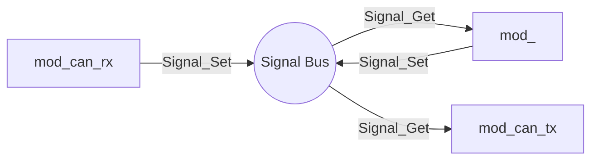
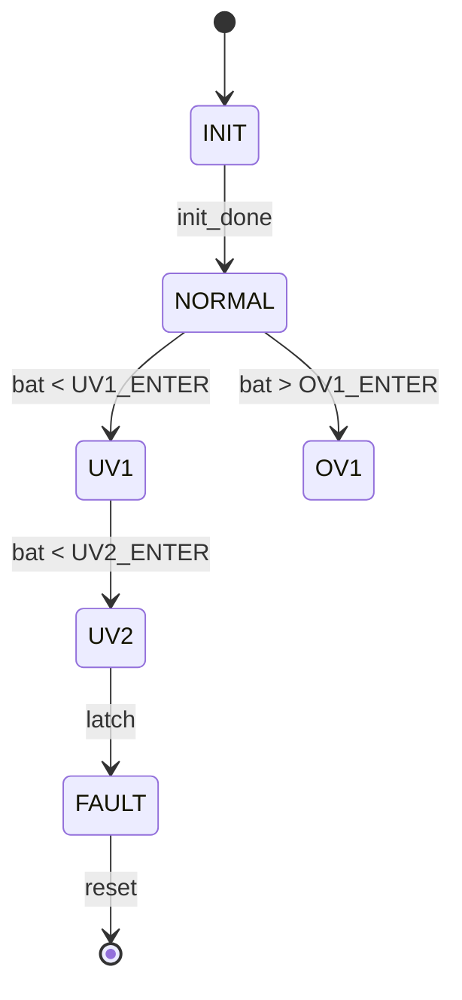

# 软件详细设计文档 (SDD) 模板

> Software Detailed Design Document
>
> 本模板适用于 C02-B2 仪表 MCU 上**业务模块**的详细设计。
> 每个业务模块（`app/<feature>/*`）建议对应一份 SDD。
> 平台层（`board/`）和工具脚本（`tools/`）可使用简化版（仅 §4、§5、§6）。
>
> **本工程示例：** `docs/SDD_POWER.md`（mod_power 的实际样例）

---

## 0. 文档信息

| 项目     | 内容 |
|----------|------|
| 模块名   | `mod_<feature>`（如 `mod_power`） |
| 文件路径 | `app/<feature>/` |
| 版本     | v0.1.0（与 `LBX_SW_VERSION_*` 对齐） |
| 作者     | <姓名> |
| 创建日期 | YYYY-MM-DD |
| 最后更新 | YYYY-MM-DD |
| 评审人   | <姓名> |
| 关联 PR  | <url> |

---

## 1. 概述 (Overview)

### 1.1 目的
简述本模块要解决什么问题、为什么需要它、与整车功能的对应关系。

### 1.2 范围 (Scope)
- **包含：** 本模块负责的业务功能、状态、对外接口。
- **不包含：** 明确指出本模块**不**做什么（避免与相邻模块职责重叠）。

### 1.3 术语表

| 术语     | 含义 |
|----------|------|
| IGN      | 点火信号 (KL15) |
| KL30     | 常电 |
| ...      | ... |

---

## 2. 参考文档 (References)

- 项目架构：`docs/ARCHITECTURE.md`
- Doxygen 注释规范：`docs/DOXYGEN_STYLE.md`
- 信号总线使用指南：`docs/SIGNAL_GUIDE.md`
- 关联模块 SDD：`docs/SDD_<OTHER>.md`
- 整车规范 / 客户需求：<链接 / 文档号>
- 相关标准：ISO 26262、GB/T 19826 等（按需）

---

## 3. 设计约束 (Design Constraints)

- **运行环境**：YTM32B1M, Cortex-M0+, 1 kHz LPTMR tick
- **资源预算**：ROM < 4 KB，RAM < 1 KB，CPU < 2%（主循环占比）
- **周期约束**：<主循环周期，如 10 ms>
- **错误恢复**：从 KL30 掉电到 MCU 复位的最大允许时间为 X ms
- **安全等级**：QM / ASIL-A / B（按 ISO 26262）
- **编码约束**：
  - 遵循 `tools/check.sh` + `tools/check_doxygen.sh`（CI 卡点）
  - 模块内禁止 `extern` 跨文件全局变量
  - 跨模块数据走 `Signal_*` 总线
  - `static` 关键字封装内部状态

---

## 4. 模块结构 (Module Structure)

### 4.1 文件清单

| 文件 | 行数 | 职责 |
|------|------|------|
| `<feature>.h` | XX | 公开 API + 模块描述符声明 |
| `<feature>.c` | XX | 实现 + 私有 helper |

### 4.2 内部组成

```
<feature>.c
├── 私有状态 (s_ctx)
├── 私有 helper (prv_*)   ← static，不可被外部调用
├── mod_desc_t hooks      ← init / on_ign_on / tick / standby
├── 公开 API              ← 在 <feature>.h 声明
└── 模块描述符 (mod_<feature>)
```

### 4.3 与其他模块的关系



---

## 5. 接口设计 (Interface Design)

### 5.1 公开 API（来自 `<feature>.h`）

逐条列出 `lbx_result_t Foo(...)` / `void Bar(...)` 等函数声明，
**直接复制 Doxygen 块**作为表格内容（保持单一信息源）。

| 函数 | 用途 | 调用方 |
|------|------|--------|
| `Foo()` | ... | mod_xxx |
| `Bar()` | ... | main / 中断 |

### 5.2 mod_desc_t 钩子

| 钩子 | 周期 | 职责 |
|------|------|------|
| `init(cold_boot)` | 启动时一次 | 初始化私有状态、注册 IRQ、读取初始传感器 |
| `on_ign_on()` | IGN 上升沿 | 重置 IGN-off 计数器、归零指针 |
| `tick()` | 每个主循环 | 内部按 RTI 子周期分发 |
| `standby()` | 进入低功耗 | 暂停非必要活动、关闭外设 |

### 5.3 消费的 Signal

| Signal | 触发条件 | 用途 |
|--------|----------|------|
| `SIG_IGN_ON` | 任意模块发布 | 决定是否唤醒 |
| `SIG_XXX`    | ... | ... |

### 5.4 发布的 Signal

| Signal | 值域 | 更新周期 | 触发条件 |
|--------|------|----------|----------|
| `SIG_XXX` | 0..100 | 100 ms | tick 内更新 |

---

## 6. 数据结构 (Data Structure)

### 6.1 私有上下文

```c
typedef struct {
    u8  init_done;
    u32 last_run_tick;
    // ...
} feature_ctx_t;

static feature_ctx_t s_ctx;
```

逐字段说明（用途、初始值、并发要求）。

### 6.2 私有常量

```c
#define FEA_PERIOD_MS    100u
#define FEA_THRESHOLD_MV 6500u
```

---

## 7. 状态机 (State Machine)（如适用）



### 7.1 状态转换表

| 源状态 | 事件 | 目标状态 | 动作 |
|--------|------|----------|------|
| INIT  | init_done = 1 | NORMAL | 读取初始 ADC |
| NORMAL | bat < UV1_ENTER | UV1 | LOG_W, update SIG_PWR_MODE |
| UV2   | latched | FAULT | 关断非必要负载 |
| ... | ... | ... | ... |

---

## 8. 算法描述 (Algorithm Description)

用伪代码 / 流程图描述关键算法（如低通滤波、debounce、超时判定等）。

```c
// 伪代码示例：debounce + 滞回
if (sample != last_sample) {
    counter = 0;
    last_sample = sample;
} else if (++counter >= DEBOUNCE_TICK) {
    new_state = (sample != 0);
    if (new_state != current_state) {
        current_state = new_state;
        publish(current_state);
    }
}
```

### 8.1 时间复杂度

- 每个 tick: O(1)
- 启动 init: O(N)（N = 初始化项数）

### 8.2 数值精度

- KL30 电压：mV，12-bit ADC 量化误差 ±2 mV
- 计算使用 `u32` 中间值防溢出

---

## 9. 错误处理 (Error Handling)

| 错误源 | 检测方式 | 处理动作 | 返回值 |
|--------|----------|----------|--------|
| 传感器断路 | ADC == 0xFFF | 进入 FAULT 态 | `LBX_ERR_SENSOR_OPEN` |
| ADC 超时 | busy-wait > 1 ms | 重试一次 | `LBX_ERR_TIMEOUT` |
| 参数越界 | `id >= MAX` | 直接拒绝 | `LBX_ERR_PARAM` |
| ... | ... | ... | ... |

### 9.1 故障安全 (Fail-safe)

- 默认值：所有 Signal 在 reset 后为 invalid，Get 返回 0
- 关键 Signal 在 ISR 中更新，避免被主循环阻塞
- Watchdog 由主循环统一喂狗

---

## 10. 性能与资源 (Performance & Resource)

| 指标 | 预算 | 实测 | 备注 |
|------|------|------|------|
| ROM | 4 KB | ? KB | IAR 编译后 `*.map` 查看 |
| RAM | 1 KB | ? B |  |
| 主循环 CPU | 2 % | ? % | 逻辑分析仪 / SysTick 估算 |
| 中断峰值 | 50 µs | ? µs |  |
| tick 最坏耗时 | 200 µs | ? µs |  |

> 实测在 `tests/benchmark_<feature>.md` 记录。

---

## 11. 测试要点 (Test Points)

### 11.1 单元测试

- [ ] set/get 信号往返
- [ ] 越界参数返回 `LBX_ERR_PARAM`
- [ ] 边界值（0、MAX、MAX+1）
- [ ] 状态机所有转移路径

### 11.2 集成测试

- [ ] 与 `mod_can_rx` 联动：收到 IGN bit → 触发 `on_ign_on`
- [ ] 与 `mod_meter` 联动：燃料信号变化 → 指针移动
- [ ] KL30 掉电 → 进入 sleep 流程

### 11.3 故障注入

- [ ] 持续 1 s 无 CAN 帧 → SIG_CAN_RX_TIMEOUT_MAP 置位
- [ ] ADC 通道短路 → 进入 FAULT

### 11.4 验收

- [ ] 通过 `tools/check.sh`
- [ ] 通过 `tools/check_doxygen.sh`
- [ ] `tests/` 目录覆盖率 ≥ 80 %

---

## 12. 变更历史 (Revision History)

| 版本 | 日期 | 作者 | 变更说明 |
|------|------|------|----------|
| 0.1.0 | YYYY-MM-DD | <name> | 初稿 |
| 0.1.1 | YYYY-MM-DD | <name> | 增加 FAULT 状态机描述 |
